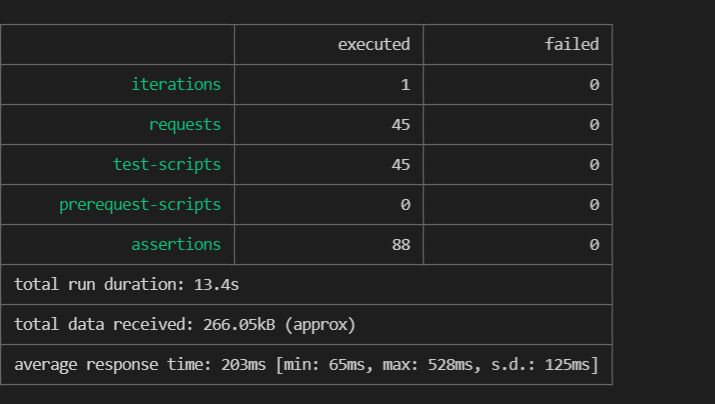

# API design assignment

## Description
API seller-market is a simple version of blocket.se where the seller/publisher must register an account to start selling their stuffs. After authentication step, the publisher can create, read, update and delete (CRUD functions) their own advertisements, their own hooks and their own account. The areas of the advertisements are generated based on 311 Municipalities in Sweden with their population that are collected from SCB until 31 Mars 2020. The resources 'publishers', 'ads', 'areas' and 'hooks' are browsable. 

## URL

URL to api: https://seller-market.herokuapp.com <br />
Database : Mongo Atlas <br />

## Test

Run:

```sh
npm test
```

(requires that [newman cli](https://www.npmjs.com/package/newman) is installed through running `npm i newman`)


[](./img/newman.PNG)

## Author
Tran Thi Kim Thanh <br />
tt222kj
