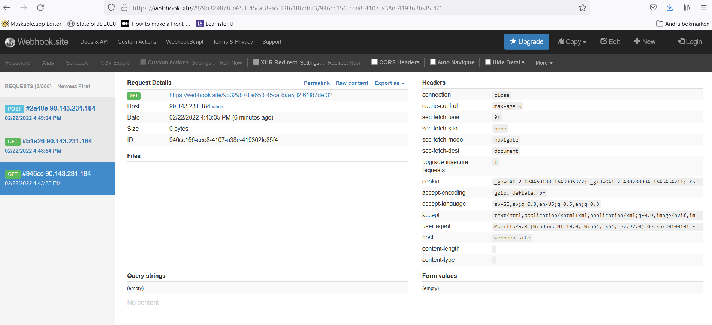

## REPORT FOR ASSIGNMENT API

### QUESTIONS
1. #### Explain and defend your implementation of HATEOAS in your solution.
The implementation of HATEOAS is done by sending links to various resources that belong to what is requested. All JSOn response bodies returned by this API tool contain the _links field that user can use to do different actions. With HATEOAS, the user can get both the data and the actions related with the data itsefl. The _links field includes itsefl and linked resources together with it's description and url. Links to each endpoint are provided by performing a GET request to the API's root router. The format of all links with href and name properties is simple, easy and clear to understand for the user and moreover is sufficient to search for the api. 

2. #### If your solution should implement multiple representations of the resources. How would you do it?
I would probably handle multiple representation through content negotiation where you can choose what you want for representation of the object. In addition, I will check the value of the Accept header in the request then the response would attemp to match the accept. The API's format like xml or version can be included in this header. Or I can specify different languages in the header. Nonetheless, the use of query parameters for deciding which fields to display is a better way. For example, I can get only the requested data provided in the select parameter and instead of simply displaying the ID, the area field will displays a name and population by adding _"/ads?select=title,description&expand=area"_ to the href.

3. #### Motivate and defend your authentication solution. 3a. What other authentication solutions could you implement? 3b. What are the pros/cons of this solution?
I have chosen JWT as authentication solution for this API because it is quite fast to adapt, does not need any cookies, easy to use and familiar with. The process is as below:
- User can register as publisher with a POST request to ROOT_URL/publishers with his email and password which must be minst 8 characters long.
- After successful registration, publisher can use his credentials to login via ROOT_URL/auth/login and receive a JWT in the response body with the information of this token like expireIn, time and date. I have set long expired time (20 days) for JWT token for the testing purpose of this assignment but in real world this time might be shorter. The publisher will also see his own ID and the ID will be set to postman environment for testing later.
- Whenever publisher wants to create, update or delete his resources, he needs to authorize himsefl with his JWT token. The authorization will be checked for Authorization header with Bearer value. If the token can not be verified, the publisher will get error code 401 (Unauthorized) in the reponse. The publisher will see the link ROOT_URL/auth/login to login and try to get another token.
- If the token is valid, mongoose will come to mongoAtlas DB to check for publisher with the same id like the id in the token and the publisher's resources will be returned. If the publisher tries to edit a resource of the other publisher, the error code 403 will be sent in the reponse.

Main pros with JWT: easy to use, flexible, automatically prevent CSRF attacks, no need for cookie consent. In this API, the JWT token is stateless and contains all needed information in its payload. 

Main cons of JWT is non revocable. It means that the stateless nature of JWT makes it difficult to revoke the token before they expire. The solution here is to have short expired time for JWT like 10 minutes but at that time the user needs to login every 10 minutes and it leads to unconvenience. So it depends on the purpose of the company the programmer can choose the suitable expired time. There have several other solution like banning users instantly, editting user's permission or changing password but it's the programmer who decides his solution.

Other authentication can be used like Oauth0, Oauth2... but i did choose JWT as recommendation from teacher.

4. #### Explain how your webhook works.

User/publisher can send a POST request with action/event and callback URL to ROOT_URL/hooks to register a hook. The events can be between "createNewAd" or "registerNewPublisher" and mongoose will look up in the Mongo DB to find the hook with relevant action then continue to send a POST to the callback URL with the details information about the created resources. Publisher are free to retrieve , edit and delete their own hook with hook id. All requests will be sent to ROOT_URL/hooks or ROOT_URL/hooks/:id. The publisher needs to authenticate themselves before doing any actions with webhook. The callback URL is https://webhook.site/9b329878-e653-45ca-8aa5-f2f61f87def3 . Any request sent to this address is logged here instantly and user can checked them without refreshing. Photo below shows list of requests that user can send to callback URL. This webhook site is used for testing purpose. 

5. #### Since this is your first own web API, there are probably things you would solve in another way, looking back at this assignment. Write your thoughts about this.
There have dupplication in the actions in mongoose sometimes that i can improve next time. I have used one key for JWT to make it simplier for testing and deploying in Heroku but to make the API more secure due to crypto algorithm, a pair with public/private key should be used. The user may have option to encrypt their sensitive data like personalnumber or credit number when saving to Mongo DB. API users should have more pagination, filtering, and query options.The authentication process can be handled by other service like Firebase. I want also to "stress" the API with around 10 000 advertisements but Mongo Atlas gives only 512 MB free storage so I don't want to risk this thing and it is more difficult to check the response if there has many advertisments. 

6. #### Which "linguistic design rules" have you implemented? List them here and motivate "for each" of them very briefly why you choose them? Remember that you must consider "at least" FIVE "linguistic design rules" as the linguistic quality of your API.
*** Rule 1: Forward slash separator (/) must be used to indicate a "hierarchical relationship". ***

All router links use this rule to indicate a hierarchical relationship between resources. For example:  
https://seller-market.herokuapp.com/publishers/:id  
https://seller-market.herokuapp.com/publishers/:id/details  
https://seller-market.herokuapp.com/publishers/:id/ads  
https://seller-market.herokuapp.com/auth/login  
https://seller-market.herokuapp.com/ads/:id  

*** Rule 2: A trailing forward-slash (/) should not be included in URIs ***

When we look at all examples above, there has no trailing forward-slash at the end of the URL and even the ROOT_URL does not have this thing. Every characters with a URI represents a resource's unique identity so this trailing slash should be counted toward another not the same resource in the REST API and it should not make the imprecise indentification of a resource for the client.

*** Rule 3: Hyphens (-) should be used to improve the readability of URIs ***

Look at the BASE_URL/ROOT_URL https://seller-market.herokuapp.com, the hyphens is used between seller-market to make it easy for client to scan and intepret. This name is easy to read and understand than 'sellermarket'.

*** Rule 4:  Underscores (_) should not be used in URIs ***

All the URLs of this API don't use any underscores in the URIs. The browsers, editor and other text viewer software used to underline URIs to show that they are clickable. Having the underscores in URIs might be completely hidden  in this underlining and create confusion for the client. It is better to user hyphens instead.

*** Rule 5:  Lowercase letters should be preferred in URI paths ***

https://seller-market.herokuapp.com/publishers  
https://seller-market.herokuapp.com/ads  
https://seller-market.herokuapp.com/areas  
Lowercase letters are used in URI paths for covenience and the capital letters might lead to problems because the URIs may indentify different resources with capital letters even though you ay think that it will show the same resource. URIs is defined as case-sensitive except for scheme and host component.

*** Rule 6:  File extensions should not be included in URIs ***

No file extension is implemented in URIs of this API. A REST API should depend on the media type in the Content-Type header not contain artificial file extensions in URIs to specify the format of the message's body.

*** Rule 10:   CRUD function names or their synonyms should not be used in URIs ***

https://seller-market.herokuapp.com/publishers  
https://seller-market.herokuapp.com/ads  
https://seller-market.herokuapp.com/auth/login  
https://seller-market.herokuapp.com/areas  
CRUD functions (Create, Read, Update, Delete) are not included in the URIs because URIs should not be used to reveal what the CRUD functions perform adn URIs should only be implemented to indentify unique resources. 

7. #### Did you do something extra besides the fundamental requirements? Explain them.
- I have used Winston library to support for multiple transports which is essentially a storage device for my logs like internal server error and these errors will be saved to a specific log file.
- Validator package is implemented to check if password is strong or not with minst 8 characters. 
- isEmpty is used to require that the email of user can not be empty. 
- Password is hashed and salted with bcrypt package.
- https://webhook.site/9b329878-e653-45ca-8aa5-f2f61f87def3 is used as callback link for the user in webhook to save all logger about hooks in this unique URL.
- Several filters and paginations are implemented such as paginate 100 first advertisments with query parameter $skip_ and $limit_ for limitting the amount of advertisements in the response. HEAD and OPTIONS are implemented for all routes to ensure the correct response headers. Any unsupported method in the request will give back error code 405. 
- I do enable lean option to make Mongoose queries faster and less memory intensive. Mongoose will skip hydrating a full document and return only plain old Javascript objects (POJOs)
